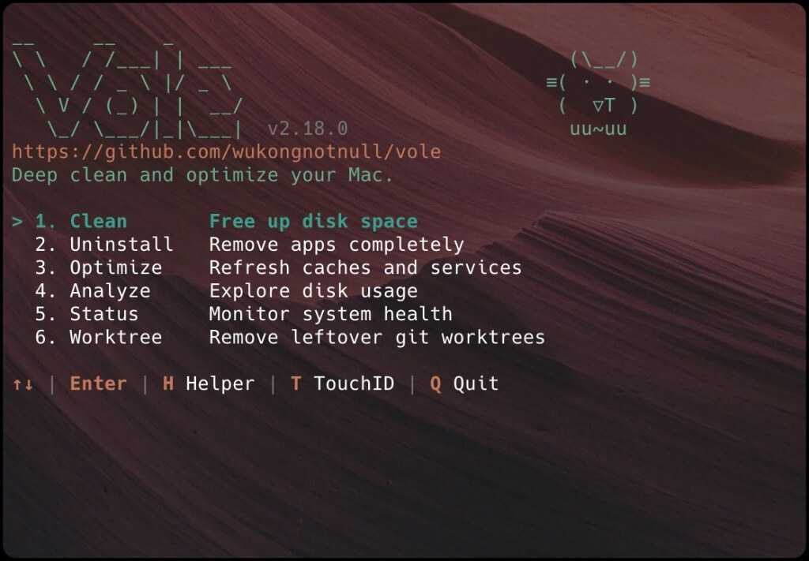

<div align="center">


# Vole

**A cleanup & monitor CLI for macOS**  
Preview first · Trash by default · One command and you’re ready

[](LICENSE)
[](https://github.com/wukongnotnull/vole/releases)
[](https://github.com/wukongnotnull/vole)
[](https://github.com/wukongnotnull/vole/releases/latest)
[](https://github.com/wukongnotnull/vole/stargazers)

</div>

**Languages:** [English](README.md) · [简体中文](README.zh-CN.md) · [繁體中文](README.zh-TW.md) · [日本語](README.ja.md) · [한국어](README.ko.md)

> Caches, logs, leftovers, installers, build junk… Vole finds them so you can **preview, then clean**. Trash by default—easy to undo if you change your mind.

---

**Quick nav**
[Screenshots](#screenshots) · [Features](#features) · [Install](#install) · [Usage](#usage) · [Safety](#safety) · [FAQ](#faq) · [Desktop app](#prefer-a-desktop-app) · [About](#about) · [Credits](#credits) · [License](#license)

---

## Screenshots

<p align="center">
  
</p>

Run `vole` in Terminal to open the interactive home menu—arrow keys to move, Enter to select.

---

## Features

| Feature | What you get |
|------|-------------|
| **Clean** | Find caches, logs, and leftovers—confirm, then clean |
| **Uninstall** | Remove apps and as much leftover data as possible |
| **Optimize** | Run a bounded set of safe system maintenance tasks |
| **Purge** | Clear bulky items like stale project build artifacts |
| **Installer** | Find forgotten `.dmg` / `.pkg` files on disk |
| **Analyze** | See which folders and large files use the most space |
| **History** | Review past cleanups and deletions |
| **Status** | Live CPU, memory, and disk health |

Type `vole` in Terminal for an interactive home menu. About **540** cleanup rules are built in—**no extra tools** to install.

For anyone comfortable with Terminal who wants a safer Mac cleaner than “delete everything in one click.” Prefer a windowed app? See Desktop app below.

---

## Install

Requires **macOS 12+**.

Current release: **[v2.16.0](https://github.com/wukongnotnull/vole/releases/tag/v2.16.0)** (Developer ID signed and notarized). Builds for Apple Silicon and Intel.

### Install with an AI prompt

Paste the block below into Cursor, Claude Code, Codex, ChatGPT, or any coding assistant. It will install Vole for you.

```text
Install Vole (a macOS cleanup & monitor CLI) on this Mac.

Official repo: https://github.com/wukongnotnull/vole
Requires macOS 12+. Install only — do not run clean / uninstall / optimize or any command that changes the system.

Do this in order and stop at the first success:
1. If Homebrew is available:
   brew tap wukongnotnull/vole https://github.com/wukongnotnull/vole
   brew install vole
2. Otherwise download the latest notarized GitHub Release tarball for this Mac
   (Apple Silicon: aarch64-apple-darwin; Intel: x86_64-apple-darwin).
   Install bin/vole to ~/.local/bin and copy share/vole/rules to ~/.local/share/vole/rules.
   If needed, add ~/.local/bin to PATH in ~/.zshrc.
3. Do not build from source unless both of the above fail.

Then run `vole --version`, and tell me the install path and version.
```

Or just say: `Install Vole from https://github.com/wukongnotnull/vole`

### Option 1: Download (recommended)

1. Open the [latest Release](https://github.com/wukongnotnull/vole/releases/latest)
2. Download the archive for your chip:
   - Apple Silicon (M-series): `…-aarch64-apple-darwin.tar.gz`
   - Intel: `…-x86_64-apple-darwin.tar.gz`
3. Put `bin/vole` somewhere on your PATH (e.g. `~/.local/bin`) and keep the bundled `share/vole/rules` folder

Example (Apple Silicon / v2.16.0; use the exact filenames from the Release page):

```bash
curl -LO https://github.com/wukongnotnull/vole/releases/download/v2.16.0/vole-2.16.0-aarch64-apple-darwin.tar.gz
tar xzf vole-2.16.0-aarch64-apple-darwin.tar.gz
mkdir -p ~/.local/bin ~/.local/share/vole
install -m 755 vole-2.16.0-aarch64-apple-darwin/bin/vole ~/.local/bin/vole
cp -R vole-2.16.0-aarch64-apple-darwin/share/vole/rules ~/.local/share/vole/
```

If Terminal says `vole: command not found`, add this to `~/.zshrc`, then run `source ~/.zshrc`:

```bash
export PATH="$HOME/.local/bin:$PATH"
```

### Option 2: Homebrew

```bash
brew tap wukongnotnull/vole https://github.com/wukongnotnull/vole
brew install vole
```

Then run `vole`. If brew fails or the version looks wrong, use the download option above.

---

## Usage

### Common commands

```bash
# Day to day
vole                           # interactive home (easiest)
vole status                    # machine health
vole analyze                   # what's using disk
vole clean                     # scan → confirm → clean (Trash by default)
vole uninstall                 # interactive app uninstall
vole optimize                  # system maintenance
vole history                   # review past work

# Preview only—nothing deleted yet
vole clean --plan
vole uninstall --plan
vole optimize --plan
vole purge --plan
vole installer --plan

# Apply after you review
vole clean --apply <plan.json>
vole uninstall --apply <plan.json>

# Other common
vole touchid status            # sudo Touch ID status
vole update                    # upgrade to a newer release
vole remove --dry-run          # uninstall Vole itself (preview)
vole --help
vole --version
```

Trash by default. Permanent delete only when you explicitly choose it.

---

### All commands

Run bare `vole` in Terminal to open the interactive home menu.

| Command | Alias | What it does |
|------|------|------|
| `vole` | — | Interactive home (Clean / Uninstall / Optimize / Analyze / Status) |
| `vole clean` | — | Clean caches and leftovers |
| `vole uninstall` | — | Uninstall apps and leftovers |
| `vole optimize` | `optimise` | System optimization / maintenance |
| `vole status` | — | Live health panel (CPU / memory / disk) |
| `vole analyze` | `analyse` | Directory size analysis (starts in your home folder) |
| `vole history` | — | Operation history and deletion log |
| `vole purge` | — | Clear stale project build artifacts |
| `vole installer` | — | Find and clean installers |
| `vole touchid` | — | Configure sudo Touch ID (`status` / `enable` / `disable`) |
| `vole update` | — | Self-update (network only when you run it) |
| `vole remove` | — | Uninstall Vole itself |
| `vole completions` | `completion` | Generate shell completions |
| `vole help` | — | Help (also `-h` / `--help`) |
| `vole --version` | `-V` | Print version |

## Safety

```
You        ❯ vole clean → review candidates → confirm

Vole       ❯ ✓ Lists candidates first—nothing is deleted yet
             ✓ Trash by default (recoverable)
             ✓ Re-checks protected paths before applying
             ✓ Skips when unsure—never expands delete scope quietly
```

| Principle | Meaning |
|------|------|
| **Preview before act** | Terminal asks for confirmation; or use `--plan` to look only |
| **Recoverable by default** | Personal files go to Trash |
| **Clear reporting** | Distinguishes Trash vs permanent delete |
| **Auditable** | Review with `vole history` |

Everyday cleanup stays on your Mac. Network is used only when you run `vole update`.

---

## FAQ

**Q: Does it delete without asking?**  
A: Running `clean` / `optimize` in Terminal asks for confirmation (default No). Use `--plan` first if you want a list only.

**Q: I deleted the wrong thing?**  
A: Default is Trash—restore from Trash. Permanent delete cannot be restored that way.

**Q: App already gone vs still installed?**  
A: Leftovers after uninstall → `vole clean`. App still installed → `vole uninstall`.

**Q: `vole: command not found`?**  
A: Make sure the install path is on your PATH (see `~/.local/bin` above), then open a new Terminal window.

**Q: Prefer a GUI?**  
A: Use [Vole for macOS](https://github.com/wukongnotnull/vole-macos)—same cleanup power in a native window app (Apple Silicon and Intel).

**Q: What’s the relationship to Mole?**  
A: Rules and safety ideas were inspired by [Mole](https://github.com/tw93/Mole). Vole is an independent open-source project and is not affiliated with Mole.

---

## Prefer a desktop app?

[Vole for macOS](https://github.com/wukongnotnull/vole-macos) is the companion app: sidebar Clean, Uninstall, Optimize, Purge, Installer, Analyze, History, Status; Full Disk Access; optional Root privileged helper for some system paths.

Latest desktop build: [vole-macos Releases](https://github.com/wukongnotnull/vole-macos/releases/latest) (currently **v0.2.0** Universal DMG).

```text
Same cleanup power · same safety habits · Terminal or window—your choice
```

---

## About

**悟空非空也 (Wukong)** — Founder of Way to AI, indie developer, content creator.

| Platform | Link |
|------|------|
| 🌐 Website | [waytoai.cn](https://waytoai.cn) |
| 𝕏 Twitter | [悟空非空也](https://x.com/wukongnotnull) |
| 📺 Bilibili | [悟空非空也](https://space.bilibili.com/456634391) |
| ▶️ YouTube | [悟空非空也](https://www.youtube.com/@wukongnotnull) |
| 📕 Xiaohongshu | [悟空非空也](https://www.xiaohongshu.com/user/profile/5ca89c2f000000001100952b) |
| 💬 WeChat | Search「悟空非空也」 |

---

## Credits

Thanks to these products and open-source projects for pioneering macOS cleanup UX—Vole learned a lot from them:

- [Mole](https://github.com/tw93/Mole) — open-source cleaner; major inspiration for rules and safety
- [CleanMyMac](https://macpaw.com/cleanmymac) — reference for polished desktop cleanup UX
- [Tencent Lemon](https://lemon.qq.com/) — familiar system-cleaner experience for Chinese users

Vole is an independent open-source project and has no affiliation or commercial relationship with the above.

---

## License

Vole is licensed under [GPL-3.0](LICENSE).  
If you fork it into your own product, please rename it to avoid confusion and credit Mole / Vole as sources.

---

<div align="center">

GPL-3.0 license © [悟空非空也](https://github.com/wukongnotnull)

</div>
