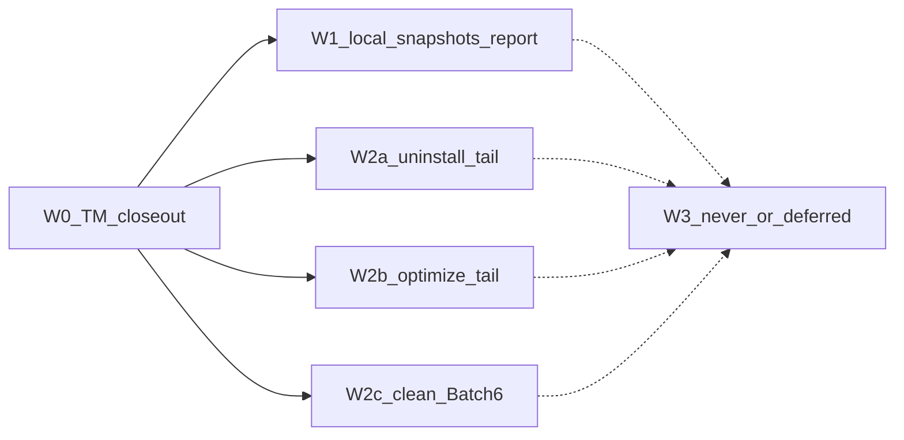

# Mole 对齐路线图（近满配 backlog · CLI）

- 日期：2026-08-08
- 状态：已批准（盘点文档）；**不开实现**，不 bump 包版本
- 依据：Mole `third_party/mole-1.48.1`；[`coverage_note`](../../../crates/vole-core/src/ops/coverage.rs)；[`2026-08-08-0025-mole-system-sh-backlog-design.md`](2026-08-08-0025-mole-system-sh-backlog-design.md)；[`2026-07-30-1900-v2-product-goals-design.md`](2026-07-30-1900-v2-product-goals-design.md)；uninstall / optimize findings
- 范围：相对 Mole 家庭桶的 **近满配** 差距——system 余量、uninstall/optimize 长尾、子命令与桌面边界；**不含**具体实现 plan（开刀时另写 design + plans）

## 1. 结论

产品 v2 CLI 主路径（`status` / `analyze` / `clean` / `history` / `uninstall` / `optimize`）已达；`clean` 的 `system.sh` 深扫主链已对齐。相对 Mole 剩余缺口按 **W0→W3** 收口：**W0 串行阻塞**收口工作区 `tm-failed-backups`；其后 **W1 与 W2 三轨可并行**；**W3 永不做或延后，只记档**。

本文件不触发实现 PR；下一刀从 §3 优先级表取项后走 brainstorming / writing-plans。

## 2. 波次顺序与并行矩阵

| 波次 | 关系 | 形态标签 |
|---|---|---|
| **W0** | 当前阻塞；完成后才开 W1/W2 | 可删（TM 失败备份） |
| **W1** | 依赖 W0；可与 W2a/b/c 并行 | 仅报告 |
| **W2a/b/c** | 依赖 W0；三轨彼此可并行；**轨内串行发版** | 可删 / 需特权 action |
| **W3** | 不开发 | 永不做 / 延后 |

### 2.1 W0 — 串行阻塞（当前）

- **项**：完成 `tm-failed-backups`（计划 **1.28.0**）：`tmbackup` / `plan` / `apply` / coverage / 发版文档收口；security-review；合并。
- **计划**：[`../plans/2026-08-08-0057-tm-failed-backups.md`](../plans/2026-08-08-0057-tm-failed-backups.md)
- **形态**：可删（仅 `tmutil delete`；fail-closed）
- **约束**：**禁止**与 W1–W2 并行半改同一批文件或争用 coverage「仍未移植」句到不稳定状态。

### 2.2 W1 — 本地快照报告

- **项**：对齐 Mole `clean_local_snapshots` 的 **报告面**：`tmutil listlocalsnapshots /` → 数量 + review 提示。
- **挂载**：优先 `vole status`；可选同步进 `analyze` 提示行。
- **形态**：仅报告；**禁止** `clean --apply` 删除本地快照（删快照属 W3 永不做，除非未来另开产品决策）。
- **触及**：`vole-sys` / `vole-core` status 采集；若 proto 追加字段则按 SemVer 评估；coverage 去掉「本地快照报告」未移植。
- **并行**：与 W2 **可并行**（命令面不同）；与 W0 **不可并行**。

### 2.3 W2 — 三条并行轨（W0 之后）

#### W2a — uninstall 长尾

依据：[`../../findings/2026-07-v2-m1-uninstall.md`](../../findings/2026-07-v2-m1-uninstall.md)

| 顺序 | 项 | 形态 |
|---|---|---|
| ① | brew cask 卸载联动 | 可删 / 编排 |
| ② | login items | 可删 / 审计 |
| ③ | 系统 LaunchDaemons / `/Library` sudo 残留（复用 PrivilegeBackend / `sudo -n`） | 可删 + 需特权 |

- **触点**：uninstall plan/apply、protection
- **并行**：可与 W2b / W2c / W1 并行；**不得**两 agent 同改 uninstall 核心路径；轨内按 ①→②→③ 发版。

#### W2b — optimize 长尾择优

依据：[`../../findings/2026-07-v2-m2-optimize-spike.md`](../../findings/2026-07-v2-m2-optimize-spike.md)；`optimize/catalog.rs` 中 `in_m3: false`

| 顺序 | task_id | 说明 | 形态 |
|---|---|---|---|
| ① | `system_maintenance` / `network_optimization` | fail-closed + 可复用 `sudo -n` | 需特权 action |
| ② | `memory_pressure_relief` | `sudo purge` | 需特权 action |
| ③ | `network_stack_optimize` / `disk_permissions_repair` / `periodic_maintenance` | 网络栈 / 权限 / periodic | 需特权 action |
| 后置或保持长尾 | `spotlight_index_optimize` / `spotlight_orphan_rules_cleanup` / `disk_verify` / `login_items_audit` / `shared_file_list_repair` | 易误伤或高复杂 | 可 indefinitely 留 coverage |

- **触点**：`optimize/catalog.rs`、tasks、optimize_plan/apply
- **并行**：与 W2a / W2c / W1 并行；**轨内串行**；catalog `in_m3` 翻转单刀单 PR。

#### W2c — clean 规则 Batch 6+

| 顺序 | 项 | 形态 |
|---|---|---|
| 按价值挑窄规则 | `dev.sh` / `app_caches` 纯 `all` | 可删 |
| **不进本波必做** | `user.sh` 广域、盲扩 `custom` | 保持「继续用 Mole」 |

- **触点**：`data/rules/`、handlers、coverage 规则计数
- **并行**：与 W2a / W2b / W1 并行。

### 2.4 W3 — 永不做 / 明确延后（只记档）

| 类别 | 项 | 标签 |
|---|---|---|
| 与 Mole keep / 安全一致 | 删除 `/Library/Updates`、`/macOS Install Data` | **永不做** |
| 产品决策 | `clean` 删除本地快照 | **永不做**（本代际） |
| 产品 v2 §4.2 代际外 | `purge` / `installer` / `touchid` / `hints` / Mole 式 `update` | **永不做（本代际）**；另开代际再议 |
| 桌面 | SMAppService / PrivilegedHelper（vole-macos） | **延后** |

引用：产品目标设计 §4.2；system backlog §「永不做」与桌面排除。

## 3. 选刀优先级（默认下一刀）

落地实现时按此取项（**不在本文件实现**）：

1. **W0** TM 收口合入  
2. **W1** 本地快照报告（PATCH / MINOR 视是否 bump proto）  
3. **并行池首刀**（任选一轨开第一 PR；另两轨可随后并进）：  
   - W2a① brew cask，或  
   - W2b① `system_maintenance` / `network_optimization`，或  
   - W2c 一条窄 `all` 规则  
4. W2 其余按各轨内顺序  
5. **W3** 仅维持 coverage / README 诚实句，不排开发

## 4. 与既有文档关系

| 文档 | 关系 |
|---|---|
| [`2026-08-08-0025-mole-system-sh-backlog-design.md`](2026-08-08-0025-mole-system-sh-backlog-design.md) | **system 对照表仍权威**；本文件为其 **超集**（含 uninstall / optimize / 子命令 / 桌面）；TM 叙事以本文件 W0 为准 |
| [`../plans/2026-08-08-0057-tm-failed-backups.md`](../plans/2026-08-08-0057-tm-failed-backups.md) | W0 实施计划 |
| [`../../findings/2026-07-v2-m1-uninstall.md`](../../findings/2026-07-v2-m1-uninstall.md) | W2a 长尾清单 |
| [`../../findings/2026-07-v2-m2-optimize-spike.md`](../../findings/2026-07-v2-m2-optimize-spike.md) | W2b 长尾清单 |
| [`2026-07-30-1900-v2-product-goals-design.md`](2026-07-30-1900-v2-product-goals-design.md) | W3「代际外」边界权威 |

## 5. 验收（本文档）

- [x] 波次 W0–W3 无 TBD；并行 / 串行写死  
- [x] 每项标明：可删 / 仅报告 / 永不做 / 延后  
- [x] 指向 system backlog、TM plan、M1/M2 findings、product goals  
- [x] 声明本文件不触发实现、不 bump 版本  

下一步：完成 W0 后，从 §3 第 2 项或并行池选刀 → 单独 design + implementation plan。
