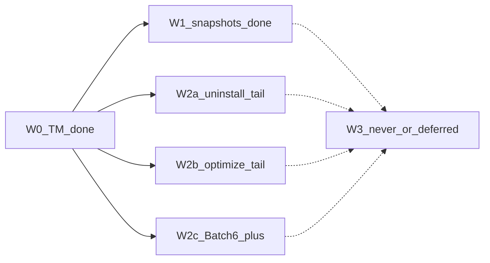

# Mole 对齐路线图（近满配 backlog · CLI）

- 日期：2026-08-08（修订：同日 W2b① / W2c 首刀合入后更新状态）
- 状态：已批准（盘点文档）；**本文件仍不开实现**，不 bump 包版本
- 依据：Mole `third_party/mole-1.48.1`；[`coverage_note`](../../../crates/vole-core/src/ops/coverage.rs)；[`2026-08-08-0025-mole-system-sh-backlog-design.md`](2026-08-08-0025-mole-system-sh-backlog-design.md)；[`2026-07-30-1900-v2-product-goals-design.md`](2026-07-30-1900-v2-product-goals-design.md)；uninstall / optimize findings
- 范围：相对 Mole 家庭桶的 **近满配** 差距——system 余量、uninstall/optimize 长尾、子命令与桌面边界；**不含**具体实现 plan（开刀时另写 design + plans）

## 1. 结论

产品 v2 CLI 主路径（`status` / `analyze` / `clean` / `history` / `uninstall` / `optimize`）已达；`clean` 的 `system.sh` 深扫主链已对齐。相对 Mole 剩余缺口按 **W0→W3** 收口：**W0（`tm-failed-backups` / 1.28.0）已合入 main（PR #67）**；**W1（本地快照报告 / 1.29.0）已合入 main（PR #70）**；**W2b①（`system_maintenance` + `network_optimization` / 1.31.0）已合入 main（PR #72，merge `63186ca`）**；**随后 main 上还有 W2c 首刀（`filo-production-cache` / 1.32.0 / PR #71）**；当前推荐继续 **W2 并行池**（W2a / W2b②+ / W2c Batch 6+ 窄规则）；**W3 永不做或延后，只记档**。

下一刀从 §3 优先级表取项后走 brainstorming / writing-plans（本文件本身不触发实现 PR）。

## 2. 波次顺序与并行矩阵

| 波次 | 关系 | 形态标签 |
|---|---|---|
| **W0** | **已完成**（1.28.0 / PR #67） | 可删（TM 失败备份） |
| **W1** | **已完成**（1.29.0 / PR #70） | 仅报告 |
| **W2a/b/c** | W0/W1 已解除阻塞；三轨彼此可并行；**轨内串行发版**；**W2b① / W2c 首刀已完成**；**当前推荐**续挑窄项 | 可删 / 需特权 action |
| **W3** | 不开发 | 永不做 / 延后 |

### 2.1 W0 — Time Machine 失败备份（已完成）

- **项**：`tm-failed-backups`（**1.28.0**）：`tmbackup` / `plan` / `apply` / coverage / 发版文档；security-review；已合并。
- **计划**：[`../plans/2026-08-08-0057-tm-failed-backups.md`](../plans/2026-08-08-0057-tm-failed-backups.md)
- **形态**：可删（仅 `tmutil delete`；fail-closed）
- **现状**：coverage「已落地」含 Time Machine 失败中备份。

### 2.2 W1 — 本地快照报告（已完成）

- **项**：对齐 Mole `clean_local_snapshots` 的 **报告面**：`tmutil listlocalsnapshots /` → 数量 + review 提示（**1.29.0** / PR #70）。
- **挂载**：`vole status` 与 `analyze` 提示行；proto 可选 `local_snapshots`。
- **形态**：仅报告；**禁止** `clean --apply` 删除本地快照（删快照属 W3 永不做，除非未来另开产品决策）。
- **现状**：coverage「仍未移植」已去掉本地快照报告；余量为桌面特权助手等。

### 2.3 W2 — 三条并行轨（当前推荐）

#### W2a — uninstall 长尾

依据：[`../../findings/2026-07-v2-m1-uninstall.md`](../../findings/2026-07-v2-m1-uninstall.md)

| 顺序 | 项 | 形态 |
|---|---|---|
| ① | brew cask 卸载联动 | 可删 / 编排 |
| ② | login items | 可删 / 审计 |
| ③ | 系统 LaunchDaemons / `/Library` sudo 残留（复用 PrivilegeBackend / `sudo -n`） | 可删 + 需特权 |

- **触点**：uninstall plan/apply、protection
- **并行**：可与 W2b / W2c 并行；**不得**两 agent 同改 uninstall 核心路径；轨内按 ①→②→③ 发版。

#### W2b — optimize 长尾择优

依据：[`../../findings/2026-07-v2-m2-optimize-spike.md`](../../findings/2026-07-v2-m2-optimize-spike.md)；`optimize/catalog.rs` 中 `in_m3: false`；设计 [`2026-08-08-0156-optimize-system-network-design.md`](2026-08-08-0156-optimize-system-network-design.md)

| 顺序 | task_id | 说明 | 形态 |
|---|---|---|---|
| **① 已完成** | `system_maintenance` / `network_optimization`（**1.31.0** / PR #72，merge `63186ca`） | fail-closed + `sudo -n` DNS flush | 需特权 action |
| ②（仍后置） | `memory_pressure_relief` | `sudo purge` | 需特权 action |
| ③（仍后置） | `network_stack_optimize` / `disk_permissions_repair` / `periodic_maintenance` | 网络栈 / 权限 / periodic | 需特权 action |
| 后置或保持长尾 | `spotlight_index_optimize` / `spotlight_orphan_rules_cleanup` / `disk_verify` / `login_items_audit` / `shared_file_list_repair` | 易误伤或高复杂 | 可 indefinitely 留 coverage |

- **触点**：`optimize/catalog.rs`、tasks、optimize_plan/apply
- **并行**：与 W2a / W2c 并行；**轨内串行**；catalog `in_m3` 翻转单刀单 PR。
- **现状**：① 已合入；`memory_pressure_relief` 及 ③、后置项仍不进本刀，保持长尾择优。

#### W2c — clean 规则 Batch 6+

| 顺序 | 项 | 形态 |
|---|---|---|
| **首刀已完成** | `filo-production-cache`（规则 534；**1.32.0** / PR #71） | 可删 |
| 按价值续挑窄规则 | `dev.sh` / `app_caches` 其余纯 `all`（Batch 6+ 可继续） | 可删 |
| **不进本波必做** | `user.sh` 广域、盲扩 `custom` | 保持「继续用 Mole」 |

- **触点**：`data/rules/`、handlers、coverage 规则计数
- **并行**：与 W2a / W2b 并行；首刀已合入后 **Batch 6+ 仍可继续挑窄 `all` 规则**（单刀单 PR）。

### 2.4 W3 — 永不做 / 明确延后（只记档）

| 类别 | 项 | 标签 |
|---|---|---|
| 与 Mole keep / 安全一致 | 删除 `/Library/Updates`、`/macOS Install Data` | **永不做** |
| 产品决策 | `clean` 删除本地快照 | **永不做**（本代际） |
| 产品 v2 §4.2 代际外 | `purge` / `installer` / `touchid` / `hints` / Mole 式 `update` | **永不做（本代际）**；另开代际再议 |
| 桌面 | SMAppService / PrivilegedHelper（vole-macos） | **延后** |

引用：产品目标设计 §4.2；system backlog §「永不做」与桌面排除。

## 3. 选刀优先级（默认下一刀）

落地实现时按此取项（**不在本文件实现**）：

1. ~~**W0** TM 收口合入~~ **已完成**（1.28.0 / PR #67）
2. ~~**W1** 本地快照报告~~ **已完成**（1.29.0 / PR #70）
3. ~~**并行池 · W2b①**~~ **已完成**：`system_maintenance` / `network_optimization`（1.31.0 / PR #72）
4. ~~**并行池 · W2c 首刀**~~ **已完成**：`filo-production-cache`（1.32.0 / PR #71）
5. **并行池续刀**（**推荐下一刀**；任选一轨开 PR；另轨可并进）：
   - W2a① brew cask，或
   - W2b② `memory_pressure_relief`（或轨内更后项；仍属后置择优），或
   - W2c Batch 6+ 再挑一条窄 `all` 规则
6. W2 其余按各轨内顺序
7. **W3** 仅维持 coverage / README 诚实句，不排开发

## 4. 与既有文档关系

| 文档 | 关系 |
|---|---|
| [`2026-08-08-0025-mole-system-sh-backlog-design.md`](2026-08-08-0025-mole-system-sh-backlog-design.md) | **system 对照表仍权威**；本文件为其 **超集**；W0/W1/W2b①/W2c 首刀状态以本文件为准 |
| [`../plans/2026-08-08-0057-tm-failed-backups.md`](../plans/2026-08-08-0057-tm-failed-backups.md) | W0 实施计划（已落地） |
| [`2026-08-08-0156-optimize-system-network-design.md`](2026-08-08-0156-optimize-system-network-design.md) | W2b① 设计（已落地，1.31.0） |
| [`../../findings/2026-07-v2-m1-uninstall.md`](../../findings/2026-07-v2-m1-uninstall.md) | W2a 长尾清单 |
| [`../../findings/2026-07-v2-m2-optimize-spike.md`](../../findings/2026-07-v2-m2-optimize-spike.md) | W2b 长尾清单 |
| [`2026-07-30-1900-v2-product-goals-design.md`](2026-07-30-1900-v2-product-goals-design.md) | W3「代际外」边界权威 |

## 5. 验收（本文档）

- [x] 波次 W0–W3 无 TBD；并行 / 串行写死
- [x] 每项标明：可删 / 仅报告 / 永不做 / 延后
- [x] 指向 system backlog、TM plan、M1/M2 findings、product goals
- [x] 声明本文件不触发实现、不 bump 版本
- [x] W0/W1/W2b①/W2c 首刀状态与 main（1.28.0 / 1.29.0 / 1.31.0 / 1.32.0）一致

下一步：从 §3 第 5 项（W2 并行池续刀）选刀 → 单独 design + implementation plan。
