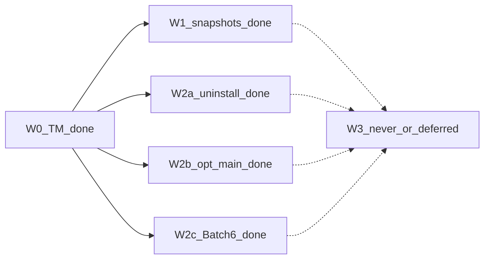

> **后续进度**：以 [`2026-08-08-1727-mole-parity-roadmap-design.md`](2026-08-08-1727-mole-parity-roadmap-design.md) 为准（全量审计 · main/1.41.0）。本文件保留近满配收口快照。

# Mole 对齐路线图（近满配 backlog · CLI）· 2026-08-08 修订

- 日期：2026-08-08（接续 [`2026-08-08-0119-mole-parity-roadmap-design.md`](2026-08-08-0119-mole-parity-roadmap-design.md) 的 1.40.0 快照）
- 状态：已批准（盘点文档）；**本文件仍不开实现**，不 bump 包版本
- 依据：Mole `third_party/mole-1.48.1`；[`coverage_note`](../../../crates/vole-core/src/ops/coverage.rs)；[`2026-08-08-0025-mole-system-sh-backlog-design.md`](2026-08-08-0025-mole-system-sh-backlog-design.md)；[`2026-07-30-1900-v2-product-goals-design.md`](2026-07-30-1900-v2-product-goals-design.md)；uninstall / optimize findings；[`2026-08-08-1642-batch6-siblings-qqmusic-design.md`](2026-08-08-1642-batch6-siblings-qqmusic-design.md)
- 范围：相对 Mole 家庭桶的 **近满配** 差距——system 余量、uninstall/optimize 长尾、子命令与桌面边界；**不含**具体实现 plan

## 1. 结论

产品 v2 CLI 主路径（`status` / `analyze` / `clean` / `history` / `uninstall` / `optimize`）已达；`clean` 的 `system.sh` 深扫主链已对齐。

相对 Mole 的 **W0→W2c 必做波次已全部收口**：

| 里程碑 | 版本 | 状态 |
|---|---|---|
| W0 `tm-failed-backups` | 1.28.0 / PR #67 | ✅ main |
| W1 本地快照报告 | 1.29.0 / PR #70 | ✅ main |
| W2a①②③ uninstall 长尾 | 1.33.0–1.35.0 / #69 #77 #79 | ✅ main |
| W2b①②③ optimize 主链 | 1.31.0 / 1.36.0 / 1.38.0 / #72 #81 #85 | ✅ main |
| W2c Filo / Zed / AG Cache / MCP Cache | 1.32.0–1.40.0 / #71 #82 #87 #89 | ✅ main |
| W2c Batch 6 收口 siblings + QQ Music AS | **1.41.0**（规则 **538–540**） | ✅ main / PR #91 |

曾短暂「暂停 Batch6 必做」；已取消并完成收口三项：`antigravity-browser-siblings`、`chrome-devtools-mcp-siblings`、`qq-music-mac-as-caches`。

**默认下一项实现：无。** optimize 后置长尾（spotlight* 等）**保持 coverage**；**W3 不开发**（仅记档）。

本文件本身不触发实现 PR。

## 2. 波次顺序与并行矩阵

| 波次 | 关系 | 形态标签 |
|---|---|---|
| **W0** | **已完成**（1.28.0 / PR #67） | 可删（TM 失败备份） |
| **W1** | **已完成**（1.29.0 / PR #70） | 仅报告 |
| **W2a/b/c** | **轨内必做已全部完成**（含 Batch 6 收口 1.41.0）；optimize 后置长尾 / W3 仅 coverage 记档 | 可删 / 需特权 action |
| **W3** | 不开发 | 永不做 / 延后 |

### 并行波次现状

| 项 | 版本 / PR | 状态 |
|---|---|---|
| W0 TM | 1.28.0 | ✅ |
| W1 本地快照报告 | 1.29.0 / #70 | ✅ |
| W2b① `system_maintenance` / `network_optimization` | 1.31.0 / #72 | ✅ |
| W2c 首项 `filo-production-cache` | 1.32.0 / #71 | ✅ |
| W2a① uninstall brew cask | 1.33.0 / #69 | ✅ |
| W2a② login items | 1.34.0 / #77 | ✅ |
| W2a③ LaunchDaemons / `/Library` sudo | 1.35.0 / #79 | ✅ |
| W2b② `memory_pressure_relief` | 1.36.0 / #81 | ✅ |
| W2c 续项 `zed-npm-system-cache` | 1.37.0 / #82 | ✅ |
| W2b③ network/disk/periodic | 1.38.0 / #85 | ✅ |
| W2c Batch 6+ `antigravity-browser-cache` | 1.39.0 / #87 | ✅ |
| W2c Batch 6+ `chrome-devtools-mcp-cache` | 1.40.0 / #89 | ✅ |
| W2c Batch 6 收口 siblings + QQ Music AS | **1.41.0** | ✅ main / PR #91（规则 540） |
| W2b spotlight* 等后置 | — | **保持 coverage** |
| W3 | — | **不开发** |

### 2.1 W0 — Time Machine 失败备份（已完成）

- **项**：`tm-failed-backups`（**1.28.0**）
- **计划**：[`../plans/2026-08-08-0057-tm-failed-backups.md`](../plans/2026-08-08-0057-tm-failed-backups.md)
- **形态**：可删（仅 `tmutil delete`；fail-closed）

### 2.2 W1 — 本地快照报告（已完成）

- **项**：`tmutil listlocalsnapshots /` → 数量 + review（**1.29.0** / PR #70）
- **形态**：仅报告；**禁止** `clean --apply` 删本地快照（属 W3）

### 2.3 W2a — uninstall 长尾（轨内必做已完成）

| 顺序 | 项 | 形态 |
|---|---|---|
| **①** | brew cask（**1.33.0** / #69） | 可删 / 编排 |
| **②** | login items（**1.34.0** / #77） | 可删 / 审计 |
| **③** | 系统 LaunchDaemons / `/Library` sudo（**1.35.0** / #79） | 可删 + 需特权 |

广谱边缘 / SMAppService → W3 或 coverage。

### 2.4 W2b — optimize 长尾（主链已完成）

| 顺序 | task_id | 版本 | 形态 |
|---|---|---|---|
| **①** | `system_maintenance` / `network_optimization` | 1.31.0 / #72 | 需特权 |
| **②** | `memory_pressure_relief` | 1.36.0 / #81 | 需特权 |
| **③** | `network_stack_optimize` / `disk_permissions_repair` / `periodic_maintenance` | 1.38.0 / #85 | 需特权 |
| 后置 | `spotlight_*` / `disk_verify` / `login_items_audit` / `shared_file_list_repair` | — | **不默认实现** |

### 2.5 W2c — clean 规则 Batch 6+（必做已完成）

| 顺序 | 项 | 版本 | 形态 |
|---|---|---|---|
| 首项 | `filo-production-cache`（534） | 1.32.0 / #71 | 可删 |
| 续项 | `zed-npm-system-cache`（535） | 1.37.0 / #82 | 可删 |
| Batch 6+ | `antigravity-browser-cache`（536） | 1.39.0 / #87 | 可删 |
| Batch 6+ | `chrome-devtools-mcp-cache`（537） | 1.40.0 / #89 | 可删 |
| **收口** | `antigravity-browser-siblings`（538）+ `chrome-devtools-mcp-siblings`（539）+ `qq-music-mac-as-caches`（540） | **1.41.0** | 可删 |
| 不做 | `user.sh` 广域、盲扩 `custom` | — | 继续用 Mole |

- **设计 / 计划（收口）**：[`2026-08-08-1642-batch6-siblings-qqmusic-design.md`](2026-08-08-1642-batch6-siblings-qqmusic-design.md)；[`../plans/2026-08-08-1642-batch6-siblings-qqmusic.md`](../plans/2026-08-08-1642-batch6-siblings-qqmusic.md)

### 2.6 W3 — 永不做 / 明确延后（只记档）

| 类别 | 项 | 标签 |
|---|---|---|
| 与 Mole keep / 安全一致 | 删除 `/Library/Updates`、`/macOS Install Data` | **永不做** |
| 产品决策 | `clean` 删除本地快照 | **永不做**（本代际） |
| 产品 v2 §4.2 代际外 | `purge` / `installer` / `touchid` / `hints` / Mole 式 `update` | **永不做（本代际）** |
| 桌面 | SMAppService / PrivilegedHelper（vole-macos） | **延后** |

## 3. 实现优先级

1. ~~W0 … W2c 至 1.40.0~~ **已完成**（详见 §2）
2. ~~W2c Batch 6 收口~~ **已完成**（1.41.0 / 规则 540）
3. **默认下一项写死**：**无默认必做项**；optimize 后置长尾保持 coverage；W3 不开发

## 4. 与既有文档关系

| 文档 | 关系 |
|---|---|
| [`2026-08-08-0119-mole-parity-roadmap-design.md`](2026-08-08-0119-mole-parity-roadmap-design.md) | **1.40.0 及更早快照**；进度以 [`1727`](2026-08-08-1727-mole-parity-roadmap-design.md) 为准 |
| [`2026-08-08-0025-mole-system-sh-backlog-design.md`](2026-08-08-0025-mole-system-sh-backlog-design.md) | system 对照表仍权威；本文件为其超集 |
| [`2026-08-08-1642-batch6-siblings-qqmusic-design.md`](2026-08-08-1642-batch6-siblings-qqmusic-design.md) | W2c Batch 6 收口设计（1.41.0） |
| [`../plans/2026-08-08-1642-batch6-siblings-qqmusic.md`](../plans/2026-08-08-1642-batch6-siblings-qqmusic.md) | 收口实施计划 |
| [`2026-07-30-1900-v2-product-goals-design.md`](2026-07-30-1900-v2-product-goals-design.md) | W3「代际外」边界权威 |
| findings M1 / M2 | uninstall / optimize 长尾清单 |

## 5. 验收（本文档）

- [x] 波次 W0–W3 无 TBD；串行 / 并行写死
- [x] 每项标明：可删 / 仅报告 / 永不做 / 延后
- [x] 声明本文件不触发实现、不 bump 版本
- [x] 相对 0119：取消 Batch6 暂停，记录 1.41.0 收口完成，默认下一项为空
- [x] 与分支现状对齐：规则约 540、包版本 1.41.0、coverage 含 siblings / QQ Music AS

下一步：**无默认实现项**。将 1.41.0 分支合入 main 后，本路线图近满配必做项关闭；optimize 长尾与 W3 仅记档。
