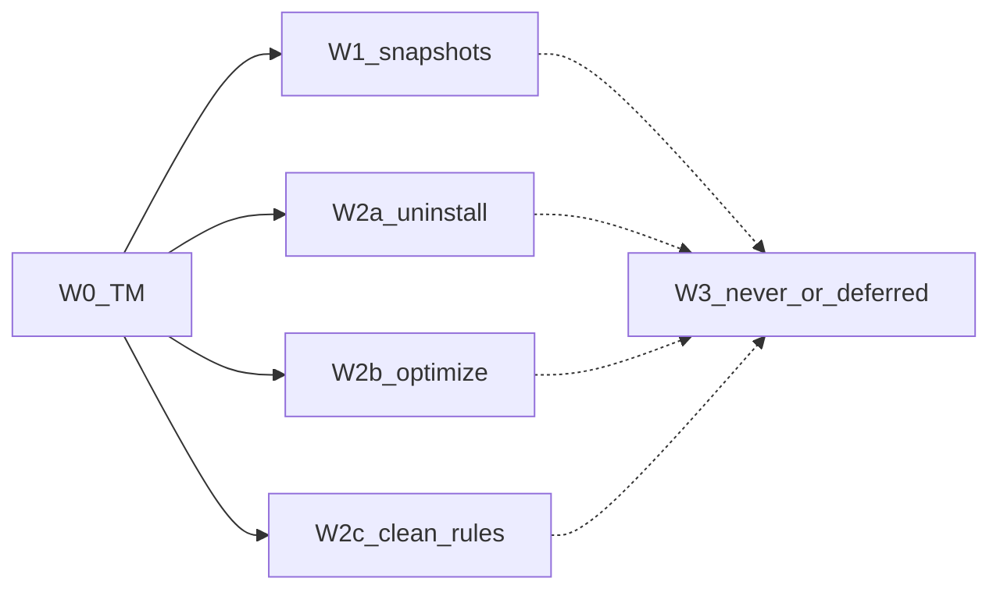

# Mole 对齐总体路线图（全量审计 · 2026-08-08）

- 日期：2026-08-08 17:27（**本文件为当前权威**）
- 状态：已批准（盘点文档）；**本文件不开实现**，不 bump 包版本
- 快照：`main` @ **1.46.0**（近满配收口 1.41.0 / PR #91；G1–G5 optimize 1.42.0–1.46.0 / PR #92 #93 #95 #97 + G5）；Mole 钉版 `third_party/mole-1.48.1`
- 依据：`scripts/inventory-mole-rules.py`；[`coverage_note`](../../../crates/vole-core/src/ops/coverage.rs)；[`optimize/catalog.rs`](../../../crates/vole-core/src/optimize/catalog.rs)；[`2026-08-08-0025-mole-system-sh-backlog-design.md`](2026-08-08-0025-mole-system-sh-backlog-design.md)；[`2026-07-30-1900-v2-product-goals-design.md`](2026-07-30-1900-v2-product-goals-design.md)；M1/M2 findings；[`2026-08-08-1646-mole-parity-roadmap-design.md`](2026-08-08-1646-mole-parity-roadmap-design.md)（近满配收口快照）
- 范围：相对 Mole 家庭桶的 **clean / uninstall / optimize / CLI 子命令 / 桌面** 全量差距盘点、优先级与先后顺序；**不含**具体实现 plan

## 1. 结论

相对 Mole 1.48.1，近满配必做（W0→W2c）已全部完成（`main` / **1.41.0**）。闸控轨 G1–G5（含推翻默认的 `disk_verify`）已于 **1.42.0–1.46.0** 落地。启用清理规则 **540**；Mole `safe_clean` inventory **507/513** 匹配（余 6 条为动态 custom 假阴性，见 §3.1）。**默认下一项实现：无**（仅剩桌面 D1）。本文件本身不触发实现 PR。

### 1.1 已对齐（相对 Mole 家庭桶）

**CLI 子命令**

- `status`
- `analyze`
- `clean`（含 `--plan` / `--apply`、白名单、JSON）
- `history`
- `uninstall`
- `optimize`
- shell `completions`

**clean · system 深扫**

- `/Library/Caches` 临时缓存年龄扫
- `/private/tmp` + `/private/var/tmp`
- 系统 DiagnosticReports
- `/private/var/log` 旧日志
- Adobe / CreativeCloud / adobegc 系统日志
- Install macOS\*.app（年龄 / SWU / 版本守卫）
- `*.code_sign_clone`
- Icon Services 系统缓存
- GPU Metal caches
- idleassetsd `CFNetworkDownload_*.tmp`
- `/private/var/db/diagnostics`（含 tracev3）
- DiagnosticPipeline / powerlog / MemoryLimitViolations
- Rosetta `/Library` update bundle
- Time Machine 失败中备份（`tmutil delete`）
- 本地快照 **仅报告**（`status` / `analyze`；不删）
- Keep 与 Mole 一致：不删 `/Library/Updates`、`/macOS Install Data`

**clean · 用户 / 开发者规则与自定义**

- 静态 `safe_clean` 路径主库存（约 507 条匹配 + Vole 扩规则至 540）
- orphaned app data（Caches / Logs / Saved State）
- Claude Desktop workspace VM orphan、Claude pending-uploads
- system services orphan（`/Library` LaunchDaemons/Agents/PHT）
- container stubs、Group Containers、Handoff pasteboard
- Filo production Cache、Zed system-node npm cache
- Antigravity browser Cache + profile siblings
- Chrome DevTools MCP Cache + profile siblings
- QQ Music Mac AS（iRRCache / iLog / iCache / iTemp）
- FCP / 剪映 generated、XCTestDevices、Toolbox keep-N、Codex staging 等已落地项

**uninstall**

- 主路径：枚举 → plan → apply、保护层、残留、JSON
- Homebrew Cask 联动（`brew uninstall --cask` / `--zap`）
- Login Items（osascript + LoginItems helper `launchctl bootout`）
- 系统 LaunchDaemons / `/Library` sudo 残留（`PrivilegeBackend` + `sudo -n`）

**optimize（已启用 `in_m3`，23 项）**

- `system_maintenance`（DNS / Spotlight 检查）
- `network_optimization`（DNS / mDNSResponder）
- `memory_pressure_relief`（高压 `purge`）
- `network_stack_optimize` / `disk_permissions_repair` / `periodic_maintenance`
- `cache_refresh` / `saved_state_cleanup` / `fix_broken_configs`
- `sqlite_vacuum` / `launch_services_rebuild` / `dock_refresh`
- `prevent_network_dsstore` / `legacy_overrides_audit`
- `quarantine_cleanup` / `launch_agents_cleanup`
- `notification_cleanup` / `coreduet_cleanup`
- `login_items_audit`（只读审计损坏登录项；**1.42.0** / PR #92）
- `spotlight_orphan_rules_cleanup`（**1.43.0** / PR #93）
- `spotlight_index_optimize`（**1.44.0** / PR #95）
- `shared_file_list_repair`（**1.45.0** / PR #97）
- `disk_verify`（须 `VOLE_ENABLE_DISK_VERIFY=1`；**1.46.0** / G5 推翻默认）

**提权 / 交互（CLI）**

- 非交互 `sudo -n` 真删（系统路径规则）
- TTY 下至多一次 `sudo -v` 后仍走 `sudo -n`

**桌面（vole-macos）**

- Clean MVP：sidecar plan → 勾选 → apply（默认废纸篓）

### 1.2 未对齐（按处置分类）

**A. 可选长尾（已注册进 coverage，默认不实现）**

- ~~`optimize` · `login_items_audit`~~ → **已落地 1.42.0** / PR #92
- ~~`optimize` · `spotlight_orphan_rules_cleanup`~~ → **已落地 1.43.0** / PR #93
- ~~`optimize` · `spotlight_index_optimize`~~ → **已落地 1.44.0** / PR #95
- ~~`optimize` · `shared_file_list_repair`~~ → **已落地 1.45.0** / PR #97
- ~~`optimize` · `disk_verify`~~ → **已落地 1.46.0**（推翻默认；仍须 `VOLE_ENABLE_DISK_VERIFY=1`；主路径 **23**）
- clean · `user.sh` 广域扫描 / 盲扩 bash custom 循环（继续用 Mole；非路径级缺漏）
- uninstall · 广谱边缘卸载场景（非主路径）

**B. 本代际明确不做（产品 v2 §4.2 / 安全边界）**

- CLI · `purge`（项目构建物）
- CLI · `installer`
- CLI · `touchid`
- CLI · `hints`（clean 附带非破坏提示）
- CLI · Mole 式 `update`
- `clean --apply` 删除本地快照
- 删除 `/Library/Updates`、`/macOS Install Data`（与 Mole keep 一致，属刻意不对齐删除能力）

**C. 延后（另仓 / 下一代际再议）**

- 桌面 · SMAppService / PrivilegedHelper / 持久特权助手（coverage「仍未移植」）
- uninstall · 与 SMAppService 深度联动的系统级卸载边角

**说明：** inventory 报「未移植」的 6 条动态 custom（`$target` / `$label` 等）**不计入未对齐路径缺口**，见 §3.1。

## 2. 已完成波次（历史顺序 · 仅记档）

| 波次 | 内容 | 版本 / PR | 形态 |
|---|---|---|---|
| **W0** | `tm-failed-backups` | 1.28.0 / #67 | 可删 |
| **W1** | 本地快照 **仅报告** | 1.29.0 / #70 | 仅报告 |
| **W2a①②③** | brew cask → login items → LaunchDaemons/`/Library` sudo | 1.33.0–1.35.0 / #69 #77 #79 | 可删 / 需特权 |
| **W2b①②③** | DNS/mDNS → memory purge → network/disk/periodic | 1.31.0 / 1.36.0 / 1.38.0 / #72 #81 #85 | 需特权 action |
| **W2c** | Filo / Zed npm / AG Cache / MCP Cache / siblings + QQ Music AS | 1.32.0–1.41.0 / #71 #82 #87 #89 #91 | 可删 |
| **W3** | 永不做 / 延后 | — | 不开发 |

轨内曾短暂暂停 Batch 6 必做；已取消并以 1.41.0 收口三规则（538–540）合入 main。

## 3. 全量缺口盘点（相对 Mole 1.48.1）

### 3.1 clean 规则 · inventory

`python3 scripts/inventory-mole-rules.py`（2026-08-08）：

| 指标 | 值 |
|---|---|
| total / ported | 513 / 507 |
| unported_all（complexity=`all`） | **0** |
| match_reason=`none` | **6**（全部为 bash **动态 custom**，非静态路径缺漏） |

**6 条 inventory「未移植」均为路径变量 / 循环标签**，属路径匹配假阴性或已由自定义 handler / orphan 扫描覆盖：

| proposed_id（推测） | 源 | 说明 |
|---|---|---|
| `obsolete-editor-label-extension` | `app_caches.sh` | 动态 `$target` / `$editor_label` |
| `orphaned-claude-workspace-vm` | `apps.sh` | Vole 已有 Claude VM orphan（coverage 已列） |
| `orphaned-label-bundle-id` | `apps.sh` | orphan / 动态 `$match` |
| `description` | `caches.sh` | 动态 `${target_paths[@]}` |
| `label` | `dev.sh` / `user.sh` | 循环内 `$label` / `$f` |

**不视为路径级缺口**：不进入必做 backlog。`user.sh` 广域扫描、盲扩 custom 循环 **继续用 Mole**；窄规则按需另开 design，不默认排期。

`system.sh`：`clean_deep_system` 与 TM 失败备份 / 本地快照报告——见 [`0025`](2026-08-08-0025-mole-system-sh-backlog-design.md)，**余量已收口**。

### 3.2 uninstall

| 项 | 状态 |
|---|---|
| 主路径（plan/apply、保护、残留、JSON） | ✅ |
| brew cask / login items / 系统 LaunchDaemons sudo | ✅ 1.33–1.35 |
| 广谱边缘 / SMAppService 卸载联动 | **W3 / coverage**（不默认实现） |

### 3.3 optimize（唯一「可选实现」长尾）

Catalog **23** 项；`in_m3: true` **23**；`in_m3: false` **0**。P1–P5 已于 **1.42.0–1.46.0** 进入主路径（P5 经推翻默认）。

| 优先级（若未来另开代际 / 显式批准） | task_id | 风险 | 建议 |
|---|---|---|---|
| P1（相对最可控） | `login_items_audit` | AppleScript；与 uninstall login items 有重叠面 | **已落地 1.42.0** / PR #92 |
| P2 | `spotlight_orphan_rules_cleanup` | 易误伤 Spotlight 规则 | **已落地 1.43.0** / PR #93 |
| P3 | `spotlight_index_optimize` | 常需 `sudo mdutil -E`；索引重建副作用大 | **已落地 1.44.0** / PR #95 |
| P4 | `shared_file_list_repair` | 共享列表 DB；高复杂 | **已落地 1.45.0** / PR #97 |
| P5（最低） | `disk_verify` | 可能长时间卡住系统；Mole 亦偏诊断 | **已落地 1.46.0**（推翻默认；须 `VOLE_ENABLE_DISK_VERIFY=1`） |

**默认策略（历史）：** P5 曾默认拒绝升必做；推翻后仍以 opt-in 限制真扫盘。

### 3.4 CLI 子命令对照

| Mole `bin/` | Vole | 标签 |
|---|---|---|
| `status` / `analyze` / `clean` / `history` / `uninstall` / `optimize` / `completion` | ✅ | 已达 |
| `purge` | ❌ | **本代际永不做**（产品 v2 §4.2） |
| `installer` | ❌ | **本代际永不做** |
| `touchid` | ❌ | **本代际永不做** |
| `hints`（clean 附带） | ❌ | **本代际永不做** |
| Mole 式 `update` | ❌ | **本代际永不做** |

### 3.5 安全 / 产品边界（与 Mole keep 一致）

| 项 | 标签 |
|---|---|
| 删除 `/Library/Updates`、`/macOS Install Data` | **永不做** |
| `clean --apply` 删除本地快照 | **永不做**（本代际；报告面已有） |

### 3.6 桌面（vole-macos）

| 项 | 标签 |
|---|---|
| Clean MVP（sidecar plan→勾选→apply） | 另仓已有 MVP |
| SMAppService / PrivilegedHelper / sudo 助手 | **延后**；coverage 诚实面唯一「仍未移植」 |

## 4. 优先级与先后顺序

### 4.1 当前代际（1.x · 近满配之后）

1. **无默认实现项。** 不因「对齐 Mole」自动开 optimize 后置或新子命令。
2. 缺陷修复、文档、fixture、conformance、安全加固优先于任何可选长尾。
3. 若用户**显式**要求某可选项：单独 design → plan → 单 PR。optimize P1–P5 均已落地；余量为 clean/uninstall 广谱边缘与桌面 D1。

### 4.2 若另开「产品下一代际」（须重新批准，本文件不授权实施）

建议串行优先级（概念队列，非本文件任务）：

| 顺序 | 主题 | 依据 |
|---|---|---|
| 1 | 桌面特权助手（SMAppService） | coverage 唯一显式未移植；系统路径体验 |
| 2 | optimize 后置择优（`login_items_audit` → spotlight orphan → …） | §3.3 |
| 3 | `purge` / 项目构建物 | 产品 v2 曾明确排除；需新北极星 |
| 4 | `installer` / `touchid` / `hints` / `update` | 边缘；ROI 低 |

**本文件不批准开启上述队列。**

## 5. 与既有文档关系

| 文档 | 关系 |
|---|---|
| **本文件** | **2026-08-08 全量审计后权威路线图** |
| [`2026-08-08-1646-mole-parity-roadmap-design.md`](2026-08-08-1646-mole-parity-roadmap-design.md) | 1.41.0 近满配收口快照；进度与默认下一项以 **本文件** 为准 |
| [`2026-08-08-0119-mole-parity-roadmap-design.md`](2026-08-08-0119-mole-parity-roadmap-design.md) | 1.40.0 及更早快照 |
| [`2026-08-08-0025-mole-system-sh-backlog-design.md`](2026-08-08-0025-mole-system-sh-backlog-design.md) | system 对照表仍权威；余量已收口 |
| [`2026-07-30-1900-v2-product-goals-design.md`](2026-07-30-1900-v2-product-goals-design.md) | 代际外子命令与桌面边界权威 |
| [`../../findings/2026-07-v2-m1-uninstall.md`](../../findings/2026-07-v2-m1-uninstall.md) | uninstall 长尾清单（已完成） |
| [`../../findings/2026-07-v2-m2-optimize-spike.md`](../../findings/2026-07-v2-m2-optimize-spike.md) | optimize 主路径 vs 长尾划界 |
| [`../plans/2026-08-08-1739-mole-parity-closeout-gated-rails.md`](../plans/2026-08-08-1739-mole-parity-closeout-gated-rails.md) | 本规格之收口核对 + 闸控任务轨计划 |

## 6. 验收（本文档）

- [x] §1.1 / §1.2 以列表分别列出已对齐与未对齐（含可选 / 永不做 / 延后）
- [x] 相对 Mole 1.48.1 覆盖 clean / uninstall / optimize / CLI / 桌面
- [x] 已完成波次与 main/1.41.0 一致
- [x] inventory 6 条「未移植」解释为假阴性 / 动态 custom
- [x] optimize 后置写明可选优先级；P1–P5 均已落地（1.42.0–1.46.0；P5 推翻默认）
- [x] 永不做 / 延后写死；默认下一项 = 无
- [x] 声明本文件不触发实现、不 bump 版本
- [x] 任务用语统一为「实现项 / 下一项」，无含糊隐喻缩写

下一步：**无默认实现项。** optimize 长尾已空；桌面 D1 与 W3 禁区仅记档，开做须另开 design 并显式批准。
